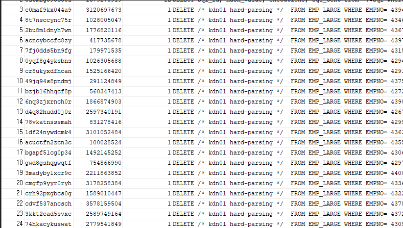
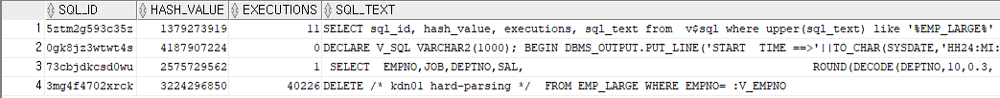
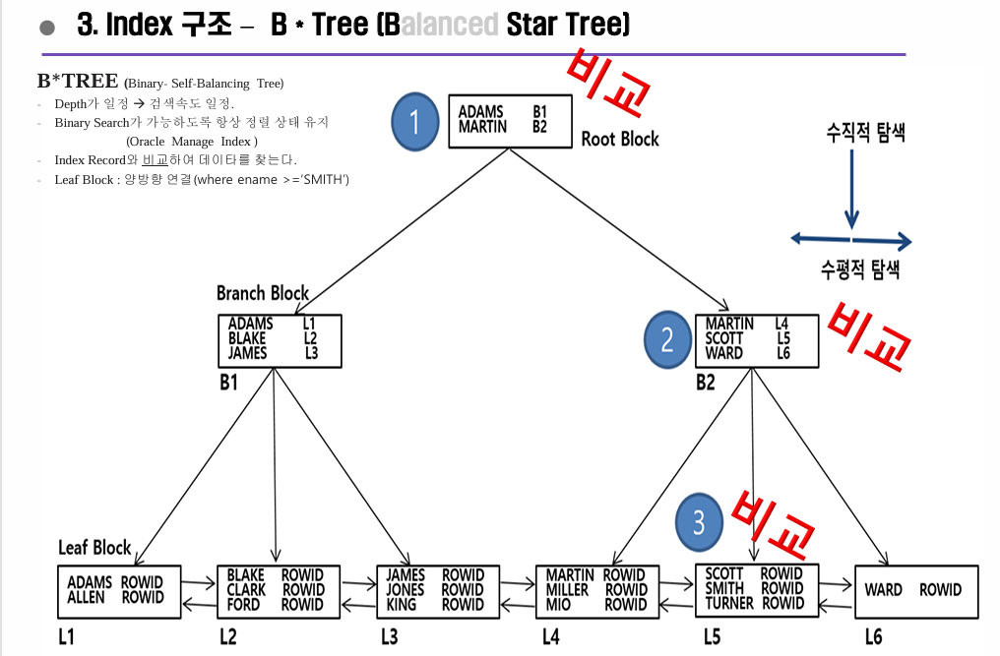

## # 소프트파싱과 하드파싱 발생


``` SQL
 -- SOFT PARSING 100만번 발생 시키는 PL/SQL Block--
SET SERVEROUTPUT ON 
DECLARE 
       V_SQL VARCHAR2(1000);
BEGIN DBMS_OUTPUT.PUT_LINE('START  TIME ==>'||TO_CHAR(SYSDATE,'HH24:MI:SS'));
FOR I IN 1..100000
LOOP
    V_SQL := 'DELETE /* kdn01 hard-parsing */  FROM EMP_LARGE WHERE EMPNO= '||TO_CHAR(I);
    EXECUTE IMMEDIATE V_SQL;        -- EXECUTE IMMEDIATE 명령어를 사용하여 동적 SQL 실행
    END LOOP;
    DBMS_OUTPUT.PUT_LINE('END    TIME ==>'||TO_CHAR(SYSDATE,'HH24:MI:SS')); 
ROLLBACK;
END;
```



프로시저에 의해 수행되는 DELETE문이 재사용이 되어지지 않음
<br>
-> 하드파싱이 발생하게 된다. -> 성능저하의 원인이 된다.

<br>
<br>

```SQL
 -- SOFT PARSING PL/SQL Block--
SET SERVEROUTPUT ON 
DECLARE V_SQL VARCHAR2(1000);
BEGIN DBMS_OUTPUT.PUT_LINE('START  TIME ==>'||TO_CHAR(SYSDATE,'HH24:MI:SS'));
FOR I IN 1..100000
LOOP
    V_SQL := 'DELETE /* kdn01 hard-parsing */  FROM EMP_LARGE WHERE EMPNO= :V_EMPNO';
    EXECUTE IMMEDIATE V_SQL USING I;        -- EXECUTE IMMEDIATE 명령어를 사용하여 동적 SQL 실행
    END LOOP;
    DBMS_OUTPUT.PUT_LINE('END TIME ==>'||TO_CHAR(SYSDATE,'HH24:MI:SS')); 
ROLLBACK;
END;
```



바인딩 파라미터로 바꾼 결과 SQL이 ``EXEUCTION`` 이 증가하며 재사용 되어지고 있음을 확인할 수 있다.



인덱스의 블록은 정렬된 상태를 유지하고 있다.
블록간에 서로 양방향 연결관계를 갖고 있다.