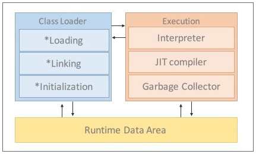
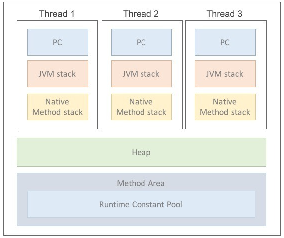

# 가비지컬렉션(Garbage Collection)에 대해서(1)

학부생 배울때부터, 자바는 C언어와는 다르게 알아서 사용하지 않은 메모리를 회수 시키고 다시 사용하게 해준다고 교수님께서 말씀하셨다.

사실 이러한 내부 동작에 대해선 크게 신경쓰지 않아도 된다고 생각하고 있었지만 경험이 쌓일수록 IT에서 가장 중요한것은 기본기였다.

가비지 컬렉션에 대해 다루기 이전에 알아야 할 JVM에 대해 간략히 다뤄보겠다.

 

가비지 컬렉션에 대해 이해하고 있어야 하는 이유는 프로그램 성능때문이다.

 

 

***그렇다면 GC는 어디서, 언제 발생할까?***

 

 

**JVM**

✔️ JVM(JAVA Virtual Machine)

자바 가상 머신의 약자를 따서 줄여 부르는 용어이다. 

JVM 역할은 실제 내가 만든 자바 코드를 읽어들여 실행시켜주는 가상 공간이다.

 

*JVM 내부 그림*

JVM은 크게 Java Compiler가 변환시킨 클래스파일을 읽어들이는 `Class Loader`와 class 파일을 해석할 수 있는 `Execution Engine`, 그리고 해석된 바이트코드를 수행 하는 `Runtime Data Area` 영역으로 구분된다.

 

여기에서 `Runtime Data Area` 영역 안을 확인하자.

✔️ PC

스레드가 어떤 명령어로 실행되어야 할지 기록하는 부분(JVM 명령의 주소를 가진다)

 

✔️ 스택 영역

지역변수, 매개변수, 메소드 정보, 임시 데이터 등을 저장한다.

 

✔️ 메서드 영역

JVM이 시작될 떄 생성되고, JVM이 읽은 각각의 클래스와 인터페이스에 대한 런타임 상수 풀, 필드 및 메서드 코드, 정적 변수 등을 보관함

 

✔️ 네이티브 메서드 스택

실제 실행할 수 있는 기계어로 작성된 프로그램을 실행시키는 영역

 

✔️ 힙 영역

런타임에 동적으로 할당되는 데이터가 저장되는 영역, 객체나 배열 데이터 생성은 여기에 저장되고 

실제 가비지 컬렉션도 이곳에서 발생한다.

 

**정리**
- JVM은 자바 가상 머신의 약자이며 자바 프로그램을 실행하기 위한 핵심 구성 요소가 구성되어 있다.
- JVM은 크게 클래스로더, 실행 엔진, 런타임 데이터 영역으로 구성되어 있다.
- 가비지 컬렉션은 JVM의 힙 영역에서 발생한다. 

 

### Reference

https://www.nowwatersblog.com/cs/JVM

https://asfirstalways.tistory.com/158

