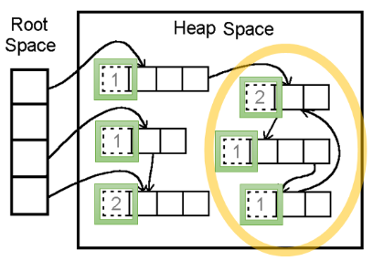
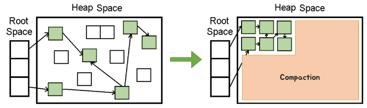

## 가비지컬렉션(Garbage Collection)에 대해서(2)

이 글은 가바지컬렉션, 두번째 내용 정리글입니다.

</br>

### 가비지 컬렉션이란 

자바의 메모리 관리 기법 중 하나로 프로그램이 동적으로 할당했던 메모리 영역 중에서 필요없게 된 영역을 해체하는 기능

 ### 장점
 - 개발자의 실수로 인한 메모리 누수를 방지해준다.
 
 ### 단점
  - 개발자가 GC의 메모리 해제 타이밍 및 실제 동작 과정을 알기가 어렵다


</br>

### GC 대표 알고리즘

아래는 GC를 구현하는 대표적인 2가지 알고리즘이다.

*1. Reference Counting*


<center>Reference Counting</center>

<br/>

그림에서 Root Space는 스택 변수, 전역 변수 등 heap 영역의 참조 값을 들고 있는 공간

Reference Counting은 힙 영역의 객체들이 각각 counting 숫자 값을 가지고 있다고 생각하고 바라보자.

숫자의 의미는 *해당 객체에 접근할 수 있는 방법의 수*를 의미한다면 만약 숫자가 0이라면 가비지 컬렉션이 된다는것을 이해할 수 있다.

하지만 이러한 Reference Counting에는 `순환 참조 문제` 라는 한계가 있다.

Root Space에서 Heap Space의 접근을 모두 끊어버린다면,

노란색 고리안의 객체들이 서로를 참조하고 있는 값만 남아있을 것이고 이러한 관계는 서로 순환하고 있기 때문에 해제되지 못한 상태로 계속 남아있게 되어 결국 메모리 누수가 발생하게 된다.

Switft는 Reference Counting 방식으로 메모리르 관리한다.

</br>

*2.MarkAndSweep*


<center>Mark And Sweep</center>

```
Mark : 사용되는 메모리와 사용되지 않는 메모리를 식별하는 작업
Sweep : Mark 단계에서 식별된 미사용 메모리를 해제하는 작업
```

Mark And Sweep은 *루트에서부터 해당 객체에 접근 가능한지*를 해제의 기준으로 적용하는 알고리즘이다.

루트부터 그래프 순회를 통해 연결된 객체를 찾아내고 (Mark) 연결이 끊어진 객체들을 지운다(Sweep)

이를 활용해 루트로부터 연결이 끊긴 순환 참조되는 객체들도 
지울 수 있다.

다만 Mark And Sweep 알고리즘은 의도적으로 **특정 순간**에 GC를 실행시켜 예기치 못한 동작을 하기도 한다.

(Java와 JavaScript가 해당 알고리즘 사용한다)

</br>
</br>

**자바의 GC**

결국 자바는 `MarkAndSweep` 알고리즘을 사용해 가비지 컬렉션이 적용하는데 그전에 자바는 가비지 컬렉션을 실행하기 위해 `Stop the World` 단계를 따른다.


