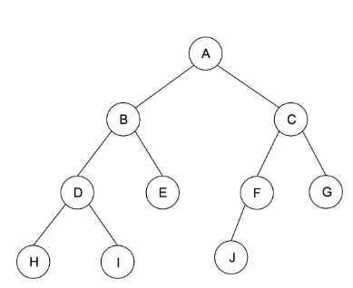
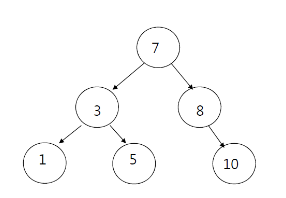

## 시작하며

트리 관련 알고리즘 문제를 풀다 이건 좀 아니다 싶어 바로 정리합니다.

내가 아는지 모르는지 확인하고 싶다면 밑에 문제 풀어보시길 바랍니다.


[1.트리 문제](https://www.acmicpc.net/problem/5639)

[2.부모 찾기](https://www.acmicpc.net/problem/11725)

[3.이진 검색 트리](https://www.acmicpc.net/problem/5639)

---

## 트리

***트리는 노드(node)로 이루어진 자료구조***

계층적인 구조를 표현할때 사용하는 자료구조이다.

디렉토리와 서브디렉토리 구조를 가지며 조직도나 가계도를 떠올리면 동일한 연상하기 편하다.



✔️ 노드 

위 그림의 A,B,C 와 같이 계층을 구성하고 있는 하나의 부분을 말한다.

</br>

## 특징

1. 그래프의 한 종류이다. `최소 연결 트리` 라고도 불린다.

2. 트리는 **계층 모델** 이다.

3. 트리는 방향성이 있는 비순환 그래프의 한 종류이다.

4. 노드가 N개인 트리는 항상 N-1개의 간선을 가진다.

5. 한 개의 루트 노드만이 존재하며 모든 자식 노드는 한 개의 부모 노드만을 가진다.

6. 순회는 Pre-order(전위순회), In-order(중위순회), Post-order(후위순회)로 이루어지며, 이 3가지 모두 DFS/BFS안에 있다.

7. 트리는 이진 트리, 이진 탐색 트리, 균형 트리, 이진 힙등이 있다.

</br>

## 이진 트리

- 각 노드가 최대 두 개의 자식을 갖는 트리
- 모든 트리가 이진 트리는 아니다.
- 이진 트리 순회
    - a. 중위 순회(In-order) : 왼쪽 -> 현재 -> 오른쪽
    ```java
    void inOrder(TreeNode node){
        if(node != null){
            inOrder(node.left);
            visit(node);
            inOrder(node.right);
        }
    }
    ```

    - b. 전위 순회(Pre-order) : 현재 -> 왼쪽 -> 오른쪽
    ```java 
    void preOrder(TreeNode node){
        if(node != null){
            visit(node);
            preOrder(node.left);
            preOrder(node.right);
        }
    }
    ```
    - c. 후위 순회(Post-order) : 왼쪽 -> 오른쪽 -> 현재
    ``` java
    void postOrder(TreeNode node){
        if(node != null){
            preOrder(node.left);
            preOrder(node.right);
            visit(node);
        }
    }
    ```

</br>

## 이진 탐색 트리

이진 탐색 트리는 모든 노드가 특정 규칙이 있다.

- 모든 왼쪽 자식들 <= n < 모든 오른쪽 자식들 




- 위 처럼 루트 노드 7은 왼쪽 자식보다는 큰 값을 가지며 오른쪽 자식보다는 작은 값을 가지고 있다.


## Reference

[트리의 특징 참고](https://gmlwjd9405.github.io/2018/08/12/data-structure-tree.html)

[이진 탐색 트리 참고](https://ratsgo.github.io/data%20structure&algorithm/2017/10/22/bst/)