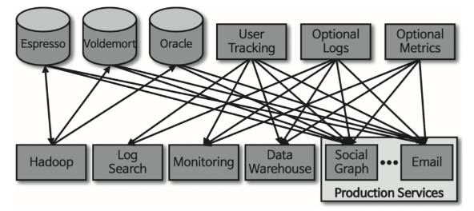
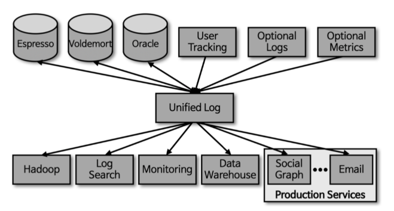
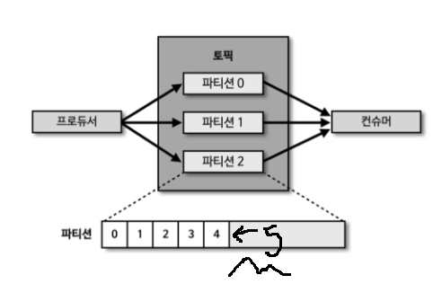

## 시작하며

2024년 배우고 싶은 기술을 *Apache Kafka*  로 정했다

그래서 며칠전 서점에서 [카프카 - 핵심 가이드](https://www.yes24.com/Product/Goods/118397432?pid=123487&cosemkid=go16824830298205674&gad_source=1&gclid=Cj0KCQiA-62tBhDSARIsAO7twbZGc00lrvYMBk4t_b_5lmMti_rbupL0YCePMnYXm6_n4LaMndidhiwaAi5XEALw_wcB) 책을 샀다.
(서점에서 33,000원 주고 샀는데 온라인은 10% 할인하네....)

 

이번 글은 `카프카`의 학습의 시작이며, 간단하게 기본 개념적인 내용, 설치, 실습, 최적화에 대한 내용을 정리하겠다.

 

> 본글에서 사용하는 모든 이미지는 ***아파치 카프카 애플리케이션 프로그래밍 with 자바, 카프가 핵심 가이드*** 에 출처가 있습니다.
--- 

### 카프카(Kakfa)

카프카는 `Streaming platform`이다.

용어부터 쉽지 않은데, 길게 말하면

`데이터 스트림`을 쓰고, 읽고, 저장하고 처리할 수 있게 해주는 시스템을 말한다.

 

✔️ 데이터 스트림

>카프카는 주로 `이벤트 스트림` 또는 `로그 스트림`과 같은 용어로 `데이터 스트림`을 표현하며, 이는 일반적으로 비동기적으로 발생하는 이벤트나 데이터를 지속적으로 처리하는것을 의미한다.

 

### Kafka의 특징

아래는 카프카 필수 개념이다.

 

#### 1. 발행/구독 메시지 전달

아파치 카프카에 대해 설명하기전에 **발행/구독 메시지 전달**의 개념과 **데이터 주도 애플리케이션**에 대해 정리하겠다.

 

 발행자와 구독자가 직접 연결된 시스템

위와 같은 시스템에 신규로 서버 확장을 하려 한다면 정말 쉽지 않을것이다.

위와 같은 초기 시스템의 개선점이었던 카프카 시스템의 특징은 **발행 구독 메시지 전달**의 특징은 전송자(발행하는 쪽)가 데이터(메시지)를 보낼 때 직접 수신자(구독하는 쪽)로 보내지 않는다는 것이다.

아래 그림을 보자.

 

 Apache Kafak 시스템

모든 애플리케이션으로 부터 지표 정보를 받는 하나의 애플리케이션을 만들고 구독한 시스템에 질의 할 수 있도록 서버를 제공해주는 시스템이 바로 Kafka이다.

정리하자면 전송자는 수신자쪽에 다이렉트로 메시지를 전달하지 않고 중계해주는 브로커에게 메시지를 전달하고 이를 구독한 수신자가 데이터를 브로커로부터 받아 처리하는 시스템이 `발행/구독 메시지 전달`시스템이다.

 

#### 2. 메시지와 배치
카프카 데이터의 기본 단위는 **메시지**이다.

카프카의 입장에서 메시지는 단순히 바이트의 배열이기 때문에 여기에 포함된 데이터에는 특정한 형식이나 의미가 없다.

하지만 내용을 이해하기 쉽도록 일정한 구조를 부여하는것을 권장한다.

가장 간단하고 권장하는 방식은 **JSON**이나 **XML**이다. 하지만 이 방식들은 타입 처리 기능이나 스키마 버전 간의 호환성유지 기능이 떨어진다는 이유로 **아파치 에이브로**를 선호한다.

✔️ 아파치 에이브로(Apache Avro)

>데이터 직렬화 프레임워크로, 데이터를 이진 형식으로 직렬화하고 효과적으로 직렬화된 데이터를 다시 역직렬화 할 수 있도록 하는 개방형 표준

 

또한 카프카는 효율성을 위해 메시지를 배치 단위로 저장한다.

왜냐하면 메시지를 쓸 때마다 네트워크상에서 신호가 오가는 것은 막대한 오버헤드를 발생시키는데, 메시지를 배치 단위로 모아서 쓰면 이를 줄일 수 있다.

물론 이것은 지연과 처리량 사이에 트레이드 오프를 발생시킨다.

즉, 배치 크기가 커질수록 시간당 처리되는 메시지의 수는 늘어나지만, 각각의 메시지가 전달되는 데 걸리는 시간은 늘어나는것이다.

배치는 더 효율적인 데이터 전송과 저장을 위해 약간의 처리 능력을 들여서 압축되는 경우가 많다.

 

#### 3. 토픽과 파티션

카프카에 저장되는 메시지는 **토픽** 단위로 분류된다.

토픽은 메시지를 구분하기 위한 폴더 개념으로 생각하면 되겠다.

토픽은 다시 여러개의 **파티션**으로 나뉘며 각각의 **파티션**은 하나의 로그에 해당한다.

하나의 토픽안에 있는 각각의 파티션에 메시지가 추가되면 각 파티션에 끝에 메시지가 추가된다는 특징이 있다.

이는 카프카가 효율적이고 신속하게 메시지를 저장하고 소비자에게 제공할 수 있기 위함이다.

 

#### 4. 프로듀서와 콘슈머

위 그림을보면 *프로듀서*와 *콘슈머*가 나오는데, 프로듀서는 새로운 메시지를 생성하고 있고 그 메시지를 컨슈머에게 보내고 있다.

즉 프로듀서는 메시지를 생성하는 역할, 컨슈머는 메시지를 읽는 역할을 하며 프로듀서를 발행자 혹은 작성자라고 부르며, 컨슈머를 구독자 혹은 독자라고도 한다.

컨슈머는 **컨슈머 그룹**의 일원으로서 작동한다. 컨슈머 그룹은 토픽에 저장된 데이터를 읽어오기 위해 협업하는 하나 이상의 컨슈머로 이루어지며 컨슈머 그룹은 각 파티션이 하나의 컨슈머에 의해서만 읽히도록 한다. 

이렇게 함으로써 대량의 메시지를 갖는 토픽들을 읽기 위해 컨슈머들을 수평 확장할 수 있다. 또한, 컨슈머 중 하나에 장애가 발생하더라도, 그룹 안의 다른 컨슈머들이 장애가 발생한 파티션을 재할당받은 뒤 이어서 데이터를 읽어올 수 있다.

 

#### 5. 브로커와 클로스터

하나의 카프카 서버를 *브로커*라고 부른다.

브로커는 프로듀서로부터 메시지를 전달받아 **오프셋**을 할당한 뒤 저장소에 쓴다.

✔️ 오프셋

> 특정 파티션 내에서 메시지의 위치를 가리키는 숫자, 위 예시에서 파티션의 번호를 말한다.

또한 브로커는 컨슈머의 파티션 읽기 요청을 처리하고 발행된 메시지를 컨슈머에게 보내준다.

 

카프카 브로커는 **클러스터**의 일부로서 작동하도록 설계되었다.

하나의 클러스터 안에 여러 개의 브로커가 포함될 수 있으며, 그 중 하나의 브로커가 클로스터 *컨트롤러* 역할을 하게 된다.

여기서 컨트롤러는 파티션을 브로커에 할당하거나 장애가 발생한 브로커는 관리 기능을 담당한다.

파티션은 클러스터 안의 브로커 중 하나가 담당하며, 그 브로커를 *파티션 리더* 라고 부른다. 

복제된 파티션이 여러 브로커에 할당할 수도 있는데 이를 파티션의 **팔로워** 라고 부른다.

복제 기능은 파티션의 메시지를 중복 저장함으로써 리더 브로커에 장애가 발생했을 때 팔로워 중 하나가 리더 역할을 이어받을 수 있도록 한다.

 

 [카프가 핵심 가이드(그림 1-7 참조)]

카프카가 클러스터안에 여러개의 브로커를 구성하는 목적은 시스템의 성능, 신뢰성, 확장성을 향상시키기 위해서이다.

다음 글에선 `KAFKA`를 설치하고 실습하는 내용을 다뤄보겠다.

### Reference
[카프카 - 핵심 가이드](https://www.yes24.com/Product/Goods/118397432?pid=123487&cosemkid=go16824830298205674&gad_source=1&gclid=Cj0KCQiA-62tBhDSARIsAO7twbZGc00lrvYMBk4t_b_5lmMti_rbupL0YCePMnYXm6_n4LaMndidhiwaAi5XEALw_wcB)
