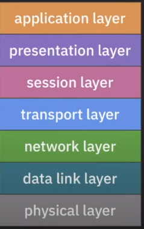

# 프로토콜과 OSI 7계층

네트워크 개념을 학습하기 위해 알아야할 필수적인 키워드라고 생각합니다.

프로토콜과 OSI 7계층에 대해 상세히 정리해보겠습니다.

## 시작전에

✔️ *네트워크?*

컴퓨터나 기타 기기들이 리소스를 공유하거나 데이터를 주고 받기 위해 연결된 통신 체계

네트워크가 제공하는 기능은 다음과 같다.

1. 애플리케이션 목적에 맞는 통신 방법 제공
2. 신뢰할 수 있는 데이터 전송 방법 제공
3. 네트워크 간의 최적의 통신 경로 설정
4. 목적지로 데이터 전송
5. 노드 사이의 데이터 전송등

이러한 네트워크의 기능을 정상적으로 이용하기 위해선 약속된 통신 규칙이 필요할 것이다. 

이러한 네트워크의 약속된 통신 규칙이 바로 **프로토콜**이다.

그럼 **프로토콜**을 이해해보자

---

## 소개

## 프로토콜

✔️ *프로토콜?*

> 네트워크 통신에 필요한 약속된 통신 규칙, 규약을 말한다.

하나의 프로토콜만으로는 모든 네트워크의 역할을 수행해 낼 수 없었고 이러한 네트워크의 기능들은 계층별로 동작하여 이를 계층 구조로 모델링을 했고 이를 `OSI model(7 layer)` 라고 한다.

 

✔️ *TCP / IP stack(4 layer)?*
> 인터넷에 특화된 네트워크 구조

 

## Reference
[쉬운코딩 - 프로토콜과 OSI 7 계층편](https://www.youtube.com/watch?v=6l7xP7AnB64)
