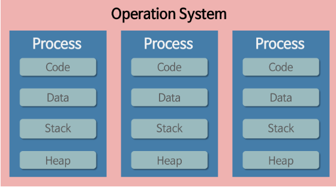
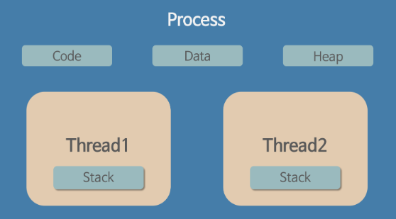

# 프로세스와 쓰레드

## 소개
운영체제에 있어 필수 개념인 두 내용을 정리해보겠습니다.
 
 

## 특징
| 특성                      | 프로세스                                      | 쓰레드                                    |
|--------------------------|---------------------------------------------|------------------------------------------|
| 기본 실행 단위             | 독립적인 실행 단위                           | 프로세스 내에서 실행되는 작은 실행 단위    |
| 자원 공유                 | 프로세스 간에 자원을 공유하지 않음            | 쓰레드는 동일한 프로세스 내에서 자원 공유 |
| 통신 방법                 | IPC (Inter-Process Communication) 사용      | 쓰레드 간 직접 메모리 공유                |
| 생성 및 소멸 오버헤드    | 높음                                        | 낮음                                     |
| 컨텍스트 스위칭 오버헤드 | 높음                                        | 낮음                                     |
| 독립성                    | 독립적인 주소 공간을 가짐                  | 공유된 주소 공간을 가짐                  |
| 특이사항                  | 프로세스 간 통신을 위한 별도의 메커니즘 필요 | 공유 자원을 관리하기 위한 동기화 필요    |

특징에 대한 내용을 상세히 확인하며 두 개념을 이해해보겠습니다.

우선 프로세스란 `독립적인 실행 단위`, 쓰레드는 `프로세스 내에서 실행되는 작은 실행 단위` 입니다.

프로세스는 우리가 코드로 개발한 애플리케이션이 동적으로 변하여 돌아가고 있는 상태를 말합니다.

지금 바로 `ctrl + alt +del` 창을 띄워 만든 작업관리자로 들어가 프로세스 탭을 확인해보면 실행중인 프로그램(=프로세스)를 확인할 수 있습니다.

 

 

*쓰레드 그림 예시*

그림과 같이 프로세스인 `Google Chrome`에서 `인터넷 강의(스레드)`를 듣거나 `유튜브 영상 스트리밍(스레드)`을 할 수도 있습니다.

그림의`인터넷 강의` 와 `유튜브 영상 스트리밍`은 쓰레드입니다. 

또한 이 둘은 프로세스인 `Chrome` 에서 동작하는 작은 실행 단위이고 2개의 쓰레드가 동작하고 있다고 말할 수 있습니다.

 

추가로 프로세스들은 작업관리자 탭에서도 볼 수 있듯이, 독립적으로 실행되고 있으며 그로 인해 자원을 서로 공유하지 않는다는 특징을 가지고 있습니다. 

반면에 쓰레드는 하나의 프로세스 내에서 구동중인 작은 실행 단위이기 때문에 프로세스내에서 사용하고 있는 자원을 서로 공유할 수 있습니다.

 

✔️ ***IPC*** : 프로세스 간의 정보를 주고받거나 서로 통신하기 위한 메커니즘(프로토콜이 네트워크 상에서 컴퓨터 간 통신 규약이라면 IPC는 로컬시스템 내에서 프로세스 간 통신)

 

---

 

**쓰레드는 왜 동기화가 필요할까?**

쓰레드는 프로세스내에서 공유된 자원을 사용하기 떄문이다.

공유된 자원을 사용하는데 여러 쓰레드가 하나의 프로세스의 자원으 접근해 처리한다면 예상치 못한 결과가 나올 수 있기 때문이다.

이로 인해 발생할 수 있는 문제는 다음과 같다.

1. 경쟁 조건(Rase Condition) : 두 개 이상의 쓰레드가 공유 자원에 동시에 접근하고 값을 수정 할 떄 발생한다.

2. 데드락(Deadlock) : 두 개 이상의 쓰레드가 서로의 작업 종료를 기다리며 무한히 대기 하는 상태를 데드락이라고 한다.

3. 쓰레드간 통신 : 쓰레드가 공유 자원을 변경할 때 해당 변경 사항이 다른 쓰레드에게 즉시 반영되지 않을 수 있다. 이로 인해 다른 쓰레드가 잘못된 데이터를 읽을 수 있다.

4. 일관성 문제 : 여러 쓰레드가 공유 자원을 동시에 읽고 쓰면, 데이터 일관성이 깨질 수 있다.

 

이러한 동기화 문제를 해결하기 위한 메커니즘으로 *뮤텍스(Mutex)*, *세마포어(Semaphore)*, *모니터(Monitor)*, *Lock*등이 사용되며, 이를 활용해 공유 자원에 대한 동시 접근을 막고 일관성 있는 실행을 보장할 수 있다.

 

Java에서는 `synchronized` 키워드, `Lock` 인터페이스등을 활용해 동기화를 구현할 수 있으며 이에 대한 내용은 따로 다룰 예정이다.

---

 

## 프로세스 & 스레드의 메모리 구조

*프로세스의 메모리 구조 그림*

프로그램이 실행되어 프로세스가 만들어지면 각각 독립된 메모리 영역(Code, Data, Stack, Heap)으로 구성되어 할당 받는다.

✔️ 코드 영역 : 개발자가 작성한 프로그램 함수르들의 코드가 CPU가 해석 가능한 기계어 형태로 저장되어 있다.

 

✔️ 데이터 영역 : 코드가 실행되면서 사용하는 전역 변수나 각종 데이터들이 모여 있다. 데이터 영역은 .data , .robota, .bss 영역으로 세분화 된다.

 

✔️ 스택 영역 : 지역 변수와 같은 호출한 함수가 종료되면 되돌아올 임시적인 자료를 저장하는 독립적인 공간이다. 
Stack은 함수의 호출과 함께 할당되며, 함수의 호출이 완료되면 소멸한다.

 

✔️ 힙 영역 : 생성자, 인스턴스와 같은 동적으로 하당되는 데이터들을 위해 존재하는 공간이다. 사용자에 의해 메모리 공간이 동적으로 할당되고 해제된다.

 

만약 여러개의 프로세스가 실행된다면 메모리에 프로세스들이 담길 주소 공간이 생성되게 되고, 그 안에 각 메모리 공간이 만들어지게 되는 것이다.

 

 

*쓰레드의 메모리 구조 그림*

스레드는 그림과 같이 프로세스 내에서 `Stack`만 따로 할당 받고 Code, Data, Heap 영역은 서로 공유한다.

이로 인해 프로세스 내에 주소 공간이나 자원들을 같은 프로세스 내에 스레드끼리 공유하면서 실행된다.

반면에 프로세스는 프로세스끼리 다른 프로세스의 메모리에 직접 접근할 수 없다.

 

## References 
[쓰레드 그림 예시](https://inpa.tistory.com/entry/%F0%9F%91%A9%E2%80%8D%F0%9F%92%BB-%ED%94%84%EB%A1%9C%EC%84%B8%EC%8A%A4-%E2%9A%94%EF%B8%8F-%EC%93%B0%EB%A0%88%EB%93%9C-%EC%B0%A8%EC%9D%B4)

[프로세스, 스레드 그림 및 내용 참조](https://gmlwjd9405.github.io/2018/09/14/process-vs-thread.html)