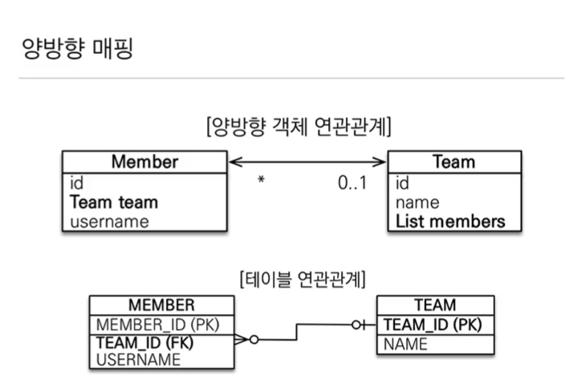

JPA 4번쨰 내용 정리 ***연관관계***에 대한 내용입니다.

</br>

이번 글은 객체와 테이블 연관관계의 차이를 이해하는것과 연관관계의 주인에 대한 개념을 이해하는것을 목표로 합니다.

> 본글에서 사용하는 모든 이미지는 ***자바 ORM 표준 JPA 프로그래밍- 기본편(김영한님 강의)*** 에 출처가 있습니다.

---

### 객체와 테이블의 연관관계

객체를 테이블에 맞추어 데이터 중심으로 모델링하면, 협력 관계를 만들 수 없다.

만약 사용자 테이블에 팀의 정보가 있다면

``` java
@Entity
private Class User{

    @Id
    @GenereatedValue
    @Column(name = "MEMEBER_ID")
    private Long id;

    @Column(Name = "USER_NAME")
    private String username;

    // 팀 테이블에 존재하는 외래키 필드
    @Column(Name = "TEAM_ID")
    prviate String teamId;

    ...
}
```

만약 신규 사용자가 추가되었다면 `teamId` 필드에 값을 세팅하기 위해선 어떻게 해야할까?

``` java

Team team = new Team();
team.setName("DESIGN TEAM");
em.persist(team);
...

User user = new User();
user.setUserName("jh");
user.setTeamId(team.getId()); // ?
...
```

위와 같이 `team` 으로 부터 데이터를 가져오고 팀 정보에 의존해 처리하는 방식은 객체 지향적인 방법이 아니다.


</br>

이를 **개선**하기 위해선 어떻게 해야할까?

결론은 `User` 테이블에 `teamId` 가 아닌 `Team` 필드를 추가한다.

```
@Entity
private Class User{

    @Id
    @GenereatedValue
    @Column(name = "MEMEBER_ID")
    private Long id;

    @Column(Name = "USER_NAME")
    private String username;

    // JPA에게 테이블의 관계를 알려줘야한다 (1:1 , 1:N)
    // 여기에선 사용자가 N, 팀이 1 그러므로 ManyToOne
    // 그리고 Join 정보 식별을 위한 어노테이션을 추가해준다.
    @ManyToOne
    @JoinColumn(name = "TEAM_ID")
    private Team team
    ...
}
```
이렇게 구성하기만 하면 된다. 

``` java
Team team = new Team();
team.setName("DESIGN TEAM");
em.persist(team);
...

User user = new User();
user.setUserName("jh");
user.setTeam(team.); // JPA가 알아서 처리해준다.
...
```

이렇게 어노테이션을 활용해 객체지향스럽게 JPA를 사용할 수 있다.

--- 

### 양방향 연관관계와 양방향 연관관계의 주인

</br>

연관관계의 주인을 이해하기 위해 우선 아래 그림을 보자



만약 `MEMBER`와 `TEAM` 테이블 모두 연관관계가 있다면 객체에선 이를 어떻게 표현해야할까?

`MEMBER`는 그대로 사용하고 `TEAM` 엔티티에 아래와 같이 설정한다.

```java
@Entity
public class Team{

    @Id
    @GeneratedValue
    @Column(name = "TEAM_ID")
    private Long id;
    private String name;

    @OneToMany(mappedBy = "team")// Member(USER)에선 @ManyToOne사용했음
    private List<Member> members = new ArrayList<>();
    ....
    
}
```

위와 같이 `@OneToMany` 어노테이션으로 관계를 설정한다

내부 `mappedBy` 의미를 알기 위해선 객체와 테이블이 관계를 맺는 차이를 알아야한다.

테이블 연관관계를 생각해보면 `TEAM_ID` 정보를 활용해 모든 정보를 알 수 있다.
(외래키 하나로 두 테이블의 연관관계를 관리)

하지만 객체의 입장에선 `TEAM`에선 `members` 를 활용했고 'MEMBER`에선 'TEAM` 을 만들었다.(단방향 연관관계 2개를 생성했음)

이렇게 구성했을 때 수정사항이 생긴 경우(만약 멤버의 팀이 바뀌었을때) 멤버 객체의 팀 정보를 수정해야할까 아니면 팀 객체의 팀 정보 변경을 해야할까 생각해볼 수 있다.

이를 개선하기 나온 개념이 `연관관계의 주인` 이다.

`TEAM`에 있는 `MEMBERS` 또는 `MEMBER`에 있는 `TEAM` 중 선택해서 주인만이 외래키를 수정할 수 있게 한다는 개념이다.

주인이 아니라면 `@mappedBy` 속성을 활용해 지정해줘야한다.

위에서 members 를 `@mappedBy` 로 지정한 이유는 이미 `Member` 클래스에 `TEAM`을 지정했기 때문이고 이렇게 `@mappedBy`로 지정하면 읽기만 가능하다.

</br>
</br>

### 주인을 어떤 기준으로 선택해야할까?

일반적으로 2개의 필드중에 주인으로 설정하기 위해 선택하는 기준은 `외래 키가 있는 있는 곳을 주인`으로 정한다.

**외래키가 있는 곳을 주인으로 정한다**라는 말을 생각해보면 `MEMBER`테이블 입장에서 생각해보면 `TEAM` 정보는 외래키 정보이다. 

그러므로 `MEMBER` 테이블에 있는 `TEAM` 필드를 외래키로 정하는게 추후 헷갈리지도 않고 성능에도 더 유리하기에 이렇게 정하는게 좋다.(외래키가 있는곳이 1:다 관계에서 `다`, `@ManyTonOne`)

</br>
</br>


**정리**

1. 이번 글의 목표였던 객체와 테이블의 연관관계를 매핑해줄때는 객체지향적으로 코드를 작성하기 위해 `외래키 필드` 만 추가하는게 아닌 `Entity` 전체를 넣은 후에 `@ManyToOne, @OneToMany`등의 어노테이션을 활용해 관계를 설정해야한다.

2. **연관관계의 주인**을 지정할때에는 `외래 키가 있는 곳을 주인`으로 설정한다.
일반적으로 생각했을때 1:다 관계에서 `다`에 해당하는 엔티티를 주인으로 설정하며 주인이 아닌곳의 엔티티에는 `@mappedBy`어노테이션을 추가해 관계를 나타낸다.

</br>
</br>

## Reference

[자바 orm 표준 JPA](https://www.inflearn.com/course/ORM-JPA-Basic/dashboard)