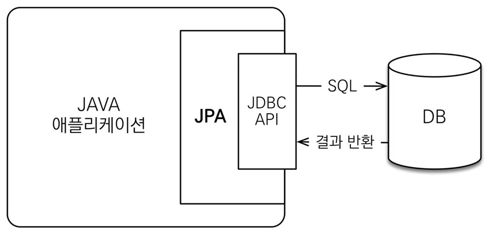

# JPA 내용 정리(1)

### 개요

지금까지 MyBatis를 사용하며 직접 Query를 작성하는 개발을 해왔지만 새 프로젝트에서 JPA를 사용하게 되었다.

새로운 기술은 무척 반갑지만 개념을 잘 모르고 사용한다면 안쓰는만 못하다고 생각한다.

앞으로 개발에 있어 JPA 개념에 대해 이해하고 사용하기 위해 정리하는 글이다.

 
 

### JPA와 Hiberante

우선 JPA의 역사는 `EJB에서 제공되던 엔터티 빈 -> Hibernate -> JPA `

역사가 이렇고 JPA의 탄생 배경이 앞선 기술의 불편함을 개선하기 위해 나온 기술이라 굉장히 실용적이다는 특징이 있다.

 

JPA가 뭔지 알기 위해 검색해보면 나오는게 `Java Persistence API`이다.

자바 표준 명세라는 의미를 가지고 있는데 여기서

표준 명세라는 의미는 **인터페이스 모음**이라는 의미다.

`JPA 2.1` 기준, 그림처럼 표준 명세를 구현한 3가지 구현체가 있는데

`Hibernate`를 대부분 사용하고 있다.(배경에서 알 수 있듯이, JAP 표준 명세 전에 Hibernate를 거의 다 구현해놓음)

정리하자면 <U>**JPA는 인터페이스 모음**</U>, <U>**Hibernate는 JAP의 구현체**</U>

 
 

### JPA 동작 원리

✔️ ORM(Object-relational mapping)
- 객체 관계 매핑
- 객체는 객체대로 설계
- ORM 프레임워크가 중간에서 매핑

ORM이라는 개념은 `객체와 관계형데이터베이스를 중간에 매핑해주는 기술`이고 JPA가 그러하다.

 

그림을 보고 이해해보자.

 
 

>Java 애플리케이션과 JPA

원래는 자바 개발자가 `JDBC API`를 사용해 개발을 했었다면 `JPA`가 중간에서 DB 작업을 해주고 있다.

 
 

>JPA의 내부 동작 상세

우리는 `DAO Layer` 에서 `Member` 객체를 JPA에게 `저장해줘` 넘기기만 하면 JPA가 알아서 분석 후 `DB INSERT QUERY` 작업까지 모두 수행해준다.

그림에선 INSERT의 예시이지만, INSERT 뿐만 아니라 ORM 기술을 사용해 객체를 중간에 매핑해주고 CRUD 작업을 대신해준다.

 
 

**정리**
- JPA는 ORM 기술을 사용하기 위한 인터페이스 모음이며, Hibernate는 JPA를 구현한 3가지 구현체 중 하나이다.
- JPA 기술을 잘 사용하기 위해선 DB와 객체 두 가지 개념을 모두 잘 알고 있어야한다.
- ORM은 객체와 관계형 데이터베이스를 중간에 매핑해주는 기술이다.

 
 

## Reference

[Spinrg-jpa 공식문서](https://docs.spring.io/spring-data/jpa/reference/jpa.html)

[자바 orm 표준 JPA](https://www.inflearn.com/course/ORM-JPA-Basic/dashboard)

