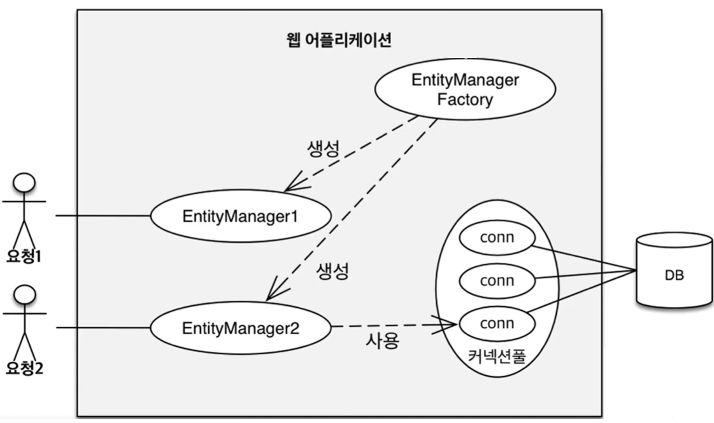
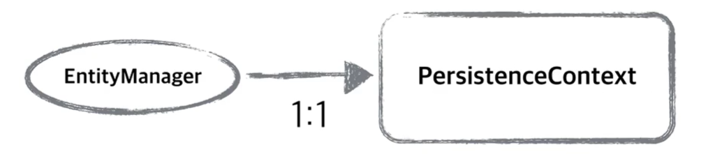
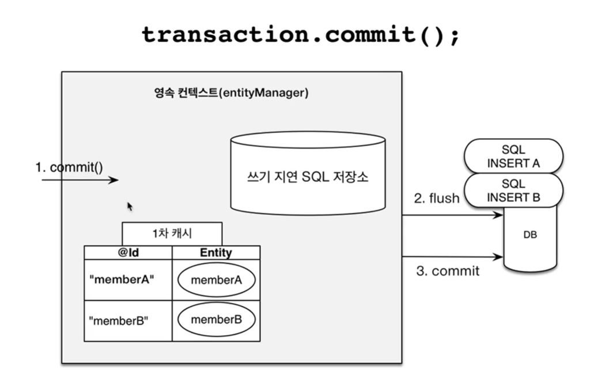
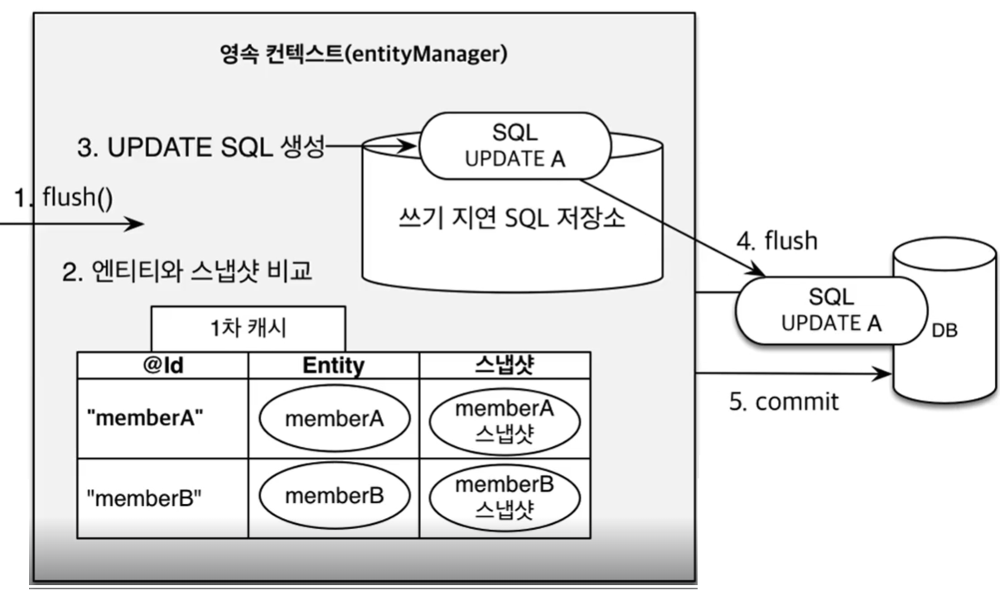

# JPA 내용 정리 - 영속성 컨텍스트

1에 이어 2번째 jpa 내용 정리입니다.

이번 글에는 JPA의 동작 원리를 이해하기 위해 `영속성 컨텍스트`에 대한 개념을 상세히 정리할 예정입니다.

</br>

### JPA 동작 원리

JPA의 동작 원리를 이해하기 위해선 `영속성 컨텍스트` 라는 것을 이해해야 한다.

✔️ 영속성 컨텍스트
- "엔티티를 영구 저장하는 환경" 이라는 뜻
- ```EntityManager.persist(entity)```

***영구 저장하는 환경***이라는 의미를 가지고 있고 `영속성 컨텍스트` 라는 것을 이해하기 위해선 `엔티티 매니저와 팩토리`와 `엔티티 매니저` 를 이해햐아한다.

</br>

아래는 이해를 돕기 위한 큰 그림이다.

</br>
</br>

> 사용자의 Request TO DB



<del>(지금은 아 이런 흐름이구나 팩토리... 매니저.. 커넥션풀... DB 흐름 정도만 이해하고 넘어가자)</del>

애플리케이션에 요청이 들어오게 되면 `엔티티 매니저 팩토리` 를 통해서 `엔티티 매니저` 를 생성하고 `엔티티 매니저`는 내부적으로 `데이터베이스 커넥션`을 사용해 DB에 접근한다.


이 과정에서 내부적으로 우리 눈에는 보이지 않지만 `EntityManager` 안에는 `영속성 컨텍스트`가 1:1로 생성 된다.




애플리케이션에서 실제 생성하는 Entity는 <U>***생명주기***</U>가 있다.

- 비영속
    - 영속성 컨텍스트와 전혀 관계가 없는 새로운 상태

    ``` java    
    User user = new User();
    user.setId("jh123");
    user.setUserName("KJH");
    ```
`User` 라는 클래스에 접근해 데이터 값을 세팅했다.
그냥 초기화한 객체에 데이터를 넣은 상태이며 영속성 컨텍스트와 아무 관련이 없는 상태이다.

=> <U>비영속상태</U>이다.

</br>
</br>

- 영속
    - 영속성 컨텍스트에 관리되는 상태
    
    ```java
    EntityManagerFactory emf = Persistence.createEntityManagerFactory("example");
    EntityManager em = emf.createEntityManager();
    em.getTransaction().begin();

    //객체를 저장한 상태(영속)
    em.persist(user);
    ```
`EntityManagerFactory`로 부터 `EntityManager` 객체를 생성하고 생성한 인스턴스에 객체가 들어가면 이제 영속상태가 된다.

이 상태는 DB에 저장된 상태가 아니며 `트랜잭션에 커밋하는 시점`에 `SQL EVENT`가 발생한다.

</br>
</br>

- 준영속
    - 영속성 컨텍스트에 저장되었다가 분리된 상태
    ```JAVA
    // 회원 엔티티를 영속성 컨텍스트에서 분리, 준영속 상태
    em.detach(user);
    ```
    

</br>
</br>

- 삭제
    - 삭제된 상태
    ```java
    // 객체를 삭제한 상태(삭제)
    em.remove(user);
    ```    

위와 같은 엔티티의 라이프 사이클이 있고 영속성 컨텍스트와 굉장히 밀접한 관계가 있는것을 알 수 있다.

</br>

정리하자면 사용자의 요청이 들어왔을때 `엔티티 매니저 팩토리`는 `엔티티 매니저`를 생성하고 `엔티티 매니저와` 1:1관계로 `영속성 컨텍스트`가 생성된다.

</br>

## 영속성 컨텍스트의 이점

엔티티 매니저가 굳이 영속성 컨텍스트를 DB 사이에 만들어 관리한 이유는 뭘까?

이러한 동작은 애플리케이션과 DB 사이에 중간 LAYER를 두게된다.

이로 인해 얻는 이점으로는 다음과 같다.

- 1차 캐시
- 동일성보장
- 트랜잭션을 지원하는 쓰기 지연
- 변경 감지
- 지연 로딩

</br>
</br>

위와 같은 이점이 있는데 구체적으로 확인해보겠다.

</br>

그래서 JUNIT 예제 코드를 작성했다.

</br>
</br>

> Junit 예제
``` java
@Slf4j
@SpringBootTest(properties = { "spring.jpa.show-sql=true", })
public class CustumTestClass {

	@PersistenceUnit
	private EntityManagerFactory emf;

	@Test
	@DisplayName("영속성 컨텍스트에 저장한 데이터 정상 조회")
	public void testPersistence() {
		 EntityManager em = emf.createEntityManager();
		try {
			User user = new User();
			user.setUsrId("jhkim1266");
			user.setUsrNm("JHKIM");
			em.persist(user);
			
			// 1차 캐시에 저장한다.
			long currentUserSeq = user.getSeq();
			User findUser = em.find(User.class, currentUserSeq);
			log.debug("user.getSeq():::::::::::::::::::::::" + user.getSeq());

            // em 매니저에 저장하지 않는 값에 대해 find를 하면 어떻게 될까?
			User previousUser = em.find(User.class, currentUserSeq + Long.valueOf(-1));
			log.debug("find previous User:::::::::::::::::::::::");

			assertEquals(findUser.getUsrNm(), "JHKIM");
			assertEquals(findUser.getUsrId(), "jhkim1266");
		} catch (Exception ex) {
			em.getTransaction().rollback();
			throw new RuntimeException(ex);
		} finally {
			em.close();
		}
	}
}

```
junit 환경에서 EntityManagerFactory로부터 EntityManager를 생성하고 `em.persist(user)` 부분을 통해 사용자 정보를 세팅했다.

PK값인 seq값을 지정하지 않은 이유는 내부 전략으로 SEQ 값의 @ID 생성 전략으로
`@GenerationType.TABLE, generator = Auditable.SEQ_NAME`을 사용해 현 테이블에 맞춰 동적으로 값을 주는 전략을 사용했기 때문이다.

이로인해 처음 `em.findUser(User.class,currrentUserSeq)` 값을 통해 현재 사용자의 PK 정보를 변수로 주어 조회했다.

로그를 보면 아래와 같다.

``` java
2024-01-11 17:48:22.242 [DEBUG] com.xxx.xxx.testPersistence:38 - user.getSeq()::::... :17
Hibernate: select user0_.seq as .... _ where user0_.seq=?
2024-01-11 17:48:22.252 [DEBUG] com.xxx.xxx.testPersistence:40 - find previous User:... // 생략
```

`Hibernate : select xxx` 의 위치를 보면

처음 `findUser` 를 조회하기 위해선 DB를 조회하지 않았지만 그 다음 `previousUser`를 조회할땐 DB 조회를 한것을 알 수 있다.

이는 데이터 조회 시 1차적으로 `영속성 컨텍스트` 가 정보를 가지고 있는지 확인해서 존재한다면 DB 조회를 하지 않지만, `영속성 컨텍스트` 에 값이 존재하지 않으면 DB에 접근해 해당 정보를 조회하는것을 알 수 있다.

`영속성 컨텍스트`의 이러한 이점은 성능 측면에서 봤을때 굉장히 이점이 있을것으로 예상했지만, 이러한 1차 캐시는 한 트랜잭션 안에서만 유효하며 여러명이 동시에 사용할 수 있는 캐시 정보가 아니어서 일반적으로 크게 유효하진 않다.

</br>
</br>

### DATA INSERT 시점

그렇다면 INSERT 할때에는 영속성 컨텍스트가 데이터를 INSERT 하는 시점이 궁금하다.



`em.persist(user)` 를 통해 저장하면 `1차 캐시` 에 들어가고 동시에 `JPA`가 엔티티를 분석해 INSERT SQL을 생성한다. 그래서 쓰기 지연 저장소라는 곳에 쌓아둔다.

즉 이 시점엔 DB에 데이터가 들어가지 않고 `쓰기 지연 저장소` 라는 곳에 쌓인 상태다.

</br>
</br>

### 그렇다면 실제 DB에 들어가는 시점은 언제?

COMMIT()을 하는 시점에 쓰기 지연 SQL 저장소에 flush()가 발생하고 실제 DB에 적재된다.

테스트 코드로 시점을 확인해보겠다.


```java
	@Test
	@DisplayName("엔티티 등록 : 영속성 컨텍스트 TO INSERT 테스트")
	public void findPersistenceInsertToDB() {

		EntityManager em = emf.createEntityManager();

		EntityTransaction tx = em.getTransaction();
		// 엔티티 매니저는 데이터 변경 시 트랜잭션을 시작해야 한다.
		tx.begin();
		try {
			User tempUser1 = new User();
			tempUser1.setUsrId("tesUser11");
			tempUser1.setUsrNm("JH");
			tempUser1.setPwd("pwd1234");

			User tempUser2 = new User();
			tempUser2.setUsrId("testUser22");
			tempUser2.setUsrNm("JH");
			tempUser2.setPwd("pwd1234");

			em.persist(tempUser1);
			em.persist(tempUser2);

			// 여기까진 INSERT SQL을 보내지 않는다.
			System.out.println("BEFORE :::::::::::::::: =================================================");
			// 커밋하는 그 순간 데이터베이스에 INSERT SQL 을 보낸다
			tx.commit();
			System.out.println("AFTER ::::::::::::::::: =================================================");
		} catch (Exception e) {
			tx.rollback();
		} finally {
			em.close();
		}
	}

```

위 테스트 코드를 보면 tempUser1,2 를 초기화해서 값을 생성했고 EntityManager Instance에 `em.persist(tempuser)`를 했다.

그림과 같이 보면 이 시점엔 `1차 캐시` 그리고 `쓰기 지연 저장소` 에 데이터가 쌓인 상태이고 실제 DB엔 값이 존재하지 않는 상태이다.

이후에 COMMIT()을 하면 DB에 값이 적재가 된다 했는데 진짜 그런지 로그를 통해 검증해보겠다.

</br>

```
BEFORE :::::::::::::::: =================================================
Hibernate: insert into user(...,..., seq) values (?, ?, ?, ?, ?, ?, ?, ?, ?, ?)
Hibernate: insert into user(...,.,., seq) values (?, ?, ?, ?, ?, ?, ?, ?, ?, ?)
AFTER ::::::::::::::::: =================================================
```

위 로그는 `COMMIT` 한 시점에 DB EVENT가 발생한다는걸 명확하게 보여주고 있다.
 


</br>
</br>

###  JPA의 UPDATE

`UPDATE`는 어떻게 동작하는지 확인해보자



UPDATE를 하기 위해서도 `EntityManager`의 인스턴스에 `em.persist(user)` 를 해야 할 것 같지만 결론적으로 그렇지 않다.

위 그림을 보면 1차 캐시에선 수정을 위해 최초로 조회한 시점의 데이터를 스냅샷 버전으로 가지고 있다.

그리고 커밋 한 시점에 내부적으로 `flush` 이벤트가 발생하는데

</br>

✔️ FLUSH

영속성 컨텍스으의 변경 사항을 데이터베이스에 반영하는 작업

</br>

이떄 `JPA`가 Entity 내부 값과 스냅샷의 값들을 모두 비교해서 다른 값이 있다면 UPDATE SQL을 `쓰기 지연 저장소`에 만들어두고 실제 DB에 반영하게 된다.

테스트 코드로 다시 확인해보겠다.

```JAVA
	@Test
	@DisplayName("변경 감지")
	public void dirtyCheckingTest() {
		EntityManager em = emf.createEntityManager();
		EntityTransaction tx = em.getTransaction();
		tx.begin();
		try {
			User user = em.find(User.class, Long.valueOf(1));
			System.out.println("before ::: user ::::::::::::" + user.getUsrId());
			// usrId (test -> JUNHKIM) UPDATE
			user.setUsrId("JUNHKIM");
			tx.commit();
			
			User sameUser = em.find(User.class, Long.valueOf(1));
			System.out.println("after ::: user::::::::::::::" + sameUser.getUsrId());
			assertEquals(sameUser.getUsrId(), "JUNHKIM");
		} catch (Exception e) {
			tx.rollback();
		} finally {
			em.close();
		}
	}

```

현재 DB의 SEQ 1에 해당하는 계정 정보가 이미 있는 상태고 ID를 조회했다.

이 시점엔 현재 엔티티 매니저에 값이 존재하지 않으므로 SELECT를 통해 실제 DB를 조회할것이다.

그리고 ID를 다른 값으로 바꾸고 COMMIT을 했고 `em.find`를 다시 해서 조회했다.
 
</br>

로그를 보면 다음과 같다.

```
Hibernate: select user0_.seq ... from t_user user_ where user.seq=?
before ::: user ::::::::::::tester
Hibernate: update ... set usr_id=? where seq=?
after ::: user::::::::::::::JUNHKIM
```

조회 SQL 이후 UPDATE SQL 작업이 발생했고 다른 작업을 하지 않았음에도 값이 업데이트 되었다.

</br>
</br>

이외에도 JAP의 영속성 컨텍스트는 `준영속상태` 라는 개념이 있다.

이는 더이상 JPA에서 데이터를 관리하지 않은 상태이고 

`em.detach(entity)` 또는 `em.clear(entity)` 등을 사용해 영속성컨텍스트의 상태를 만들 수 있다.

</br>
</br>

정리하자면 영속성 컨텍스트는 `JPA` 를 이해하는데 가장 중요한 용어이며 `엔티티를 영구 저장하는 환경` 이라는 의미를 가지고 있다.

사실 영속성 컨텍스트는 눈에 보이진 않으며 `EntityManager` 에서 1:1로 생성한다.

엔티티의 생명주기로는 `비영속`,`영속`,`준영속` 등의 상태가 있다.

추가로 플러시는 영속성 컨텍스트를 비우지 않고 영속성 컨텍스트의 변경내용을 데이터베이스에 동기화하는 작업이다.

JPA를 이해하기 위해 영속성 컨텍스트의 메커니즘을 이해한다면 많은 도움이 될거라 생각한다.

</br>
</br>

## Reference

[자바 orm 표준 JPA](https://www.inflearn.com/course/ORM-JPA-Basic/dashboard)
